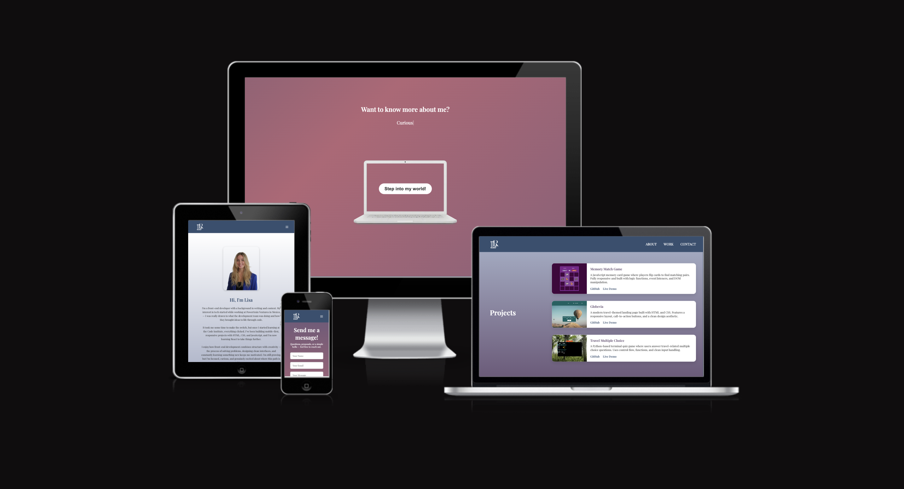
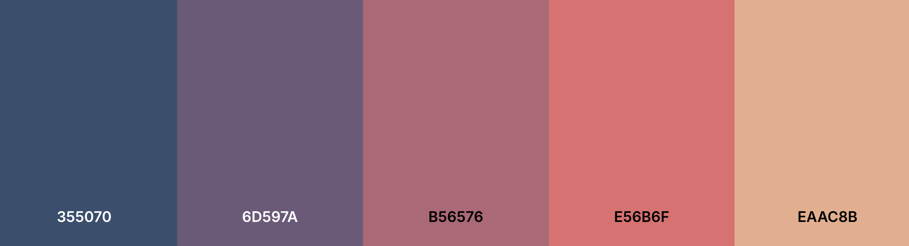
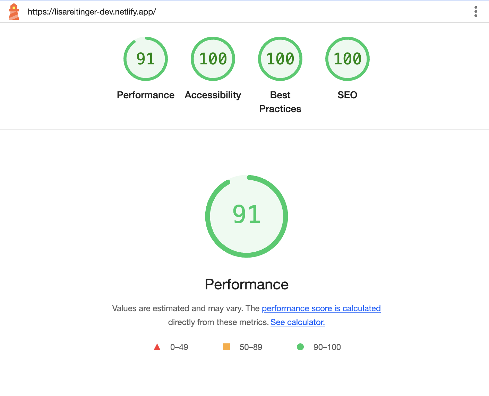

# Lisa Reitinger — Developer Portfolio

A personal portfolio website designed to showcase my work, skills, and journey as a front-end developer. Built with a strong focus on responsiveness, clean animations, performance, and storytelling.

## Responsive Design

[🔗 View Live Site on Netlify](https://lisareitinger-dev.netlify.app/)

---

## Color Palette

Inspired by a balance of professionalism and creativity, this palette was chosen to reflect warmth and approachability while maintaining clarity:

| Color Name  | Hex       | Usage               |
| ----------- | --------- | ------------------- |
| Deep Blue   | `#355070` | Background / NavBar |
| Dusty Rose  | `#B56576` | Accents / Buttons   |
| Pale Coral  | `#EAAC8B` | Section Backgrounds |
| Warm Purple | `#6D597A` | Section Transitions |
| Off-white   | `#FFF`    | Text / Highlights   |

---

## Fonts

- **Playfair Display**: Adds elegance and character.

- Fonts are imported via Google Fonts.

---

## Performance

Optimized for performance using:

- SVG icons instead of icon libraries
- Compressed images (via TinyPNG)
- Lazy loading and async handling
- Minimal, clean JavaScript

---

## Features

- Intro animation with laptop zoom and typing effect
- Fixed navigation bar that appears after intro
- Smooth scroll navigation
- Project showcase with hover effects
- Fully responsive on all screen sizes
- Contact form with Formspree integration
- SEO meta tags and favicon

---

## Tech Stack

- HTML5
- CSS3
- JavaScript
- Git & GitHub for version control
- Netlify for deployment

---

## Author

**Lisa Reitinger**  
Front-End Developer  
[GitHub Profile](https://github.com/LisaReitinger)  
[LinkedIn](https:///www.linkedin.com/in/lisareitinger/)
